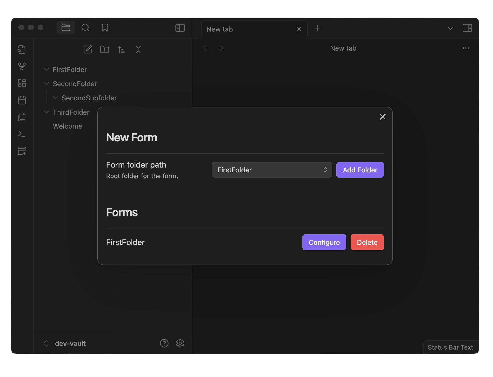
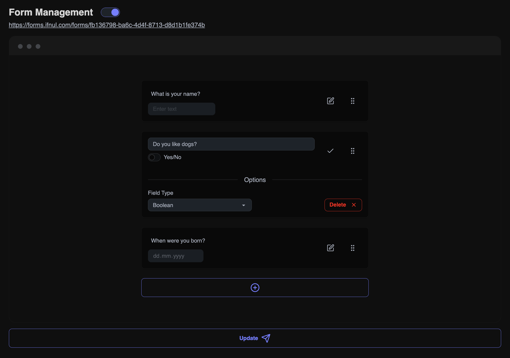
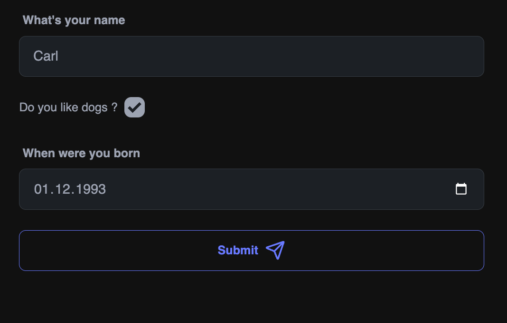
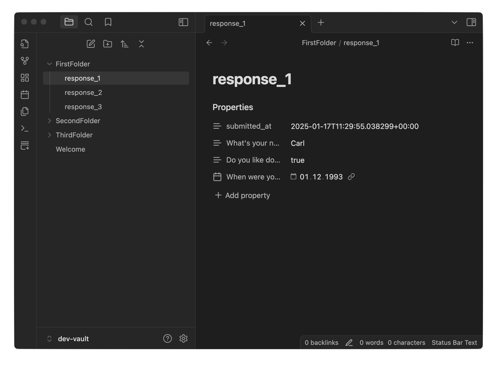

# Formsidian

Forms for obsidian

## How does it work

Use obsidian to link one of your vault's folder and than use [formsidian.com](https://formsidian.com/) to manage it.

## 1. Form Creation
- Choose an Obsidian folder as the home directory for the form.

## 2. Setting Up Questions
- Link the form with your account on the website.
- Fill in the structure of the questions.

## 3. Publishing 🎉
- Publish the form to allow others to complete it.

## 4. View Submissions
- Responses start appearing in your Obsidian vault.

